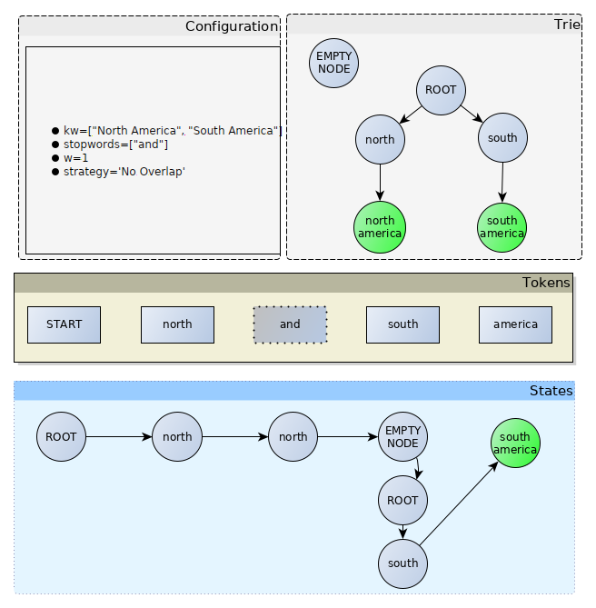
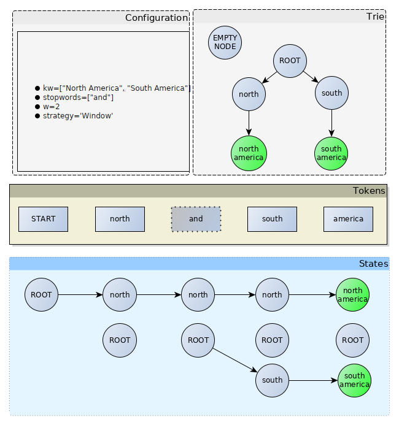
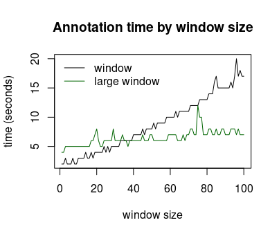

Matcher
-------
The simplest example is to search a list of words in a document.
To do so, :ref:`api_doc:Matcher` is the main public API of this package.
I recommend to use the :ref:`api_doc:Matcher build` method to simplify its construction:

With a list of words (keywords)
^^^^^^^^^^^^^^^^^^^^^^^^^^^^^^^

.. literalinclude:: ../../tests/test_doc.py
    :language: python
    :dedent:
    :start-after: # start_test_exact_match_keywords
    :end-before: # end_test_exact_match_keywords

The matcher outputs a list of :ref:`annotation:Annotation`.
By default, it performs exact match only.
A limitation of passing words to the matcher is that no attributes are associated.

With a list of entities
^^^^^^^^^^^^^^^^^^^^^^^
Often, keywords are derived from a knowledge graph that associates a label with a unique identifier.
The :ref:`api_doc:Entity` class has a *kb_id* attribute to store an identifier.

.. literalinclude:: ../../tests/test_doc.py
    :language: python
    :dedent:
    :start-after: # start_test_exact_match_ents
    :end-before: # end_test_exact_match_ents

With a custom of keyword subclass
^^^^^^^^^^^^^^^^^^^^^^^^^^^^^^^^^
If you need to add other attributes to a keyword, you can create your own :ref:`api_doc:IKeyword` implementation.

.. literalinclude:: ../../tests/test_doc.py
    :language: python
    :dedent:
    :start-after: # start_test_exact_match_custom_keyword
    :end-before: # end_test_exact_match_custom_keyword

Note you can add different keyword types.

Context window (w)
^^^^^^^^^^^^^^^^^^
iamsystem algorithm tries to match a sequence of tokens in a document to a sequence of tokens in a keyword/term.
The **w** parameter determines how much discontinuous the sequence of tokens can be.
By default, *w=1* means that the sequence must be continuous.

Let's say we want to detect the keyword *"calcium level"* in a document.
With *w=1*, the matcher wouldn't find the keyword in *"calcium blood level"*
since the sequence of tokens in the document is discontinuous.
One solution would be to add *"blood"* to the :ref:`stopwords:Stopwords` list,
however if *"blood"* is used by another keyword it would be a bad solution.
Another solution is to set *w=2* that lets the algorithm searches 2 words after token *"calcium"*.

.. literalinclude:: ../../tests/test_doc.py
    :language: python
    :dedent:
    :linenos:
    :start-after: # start_test_window
    :end-before: # end_test_window

The semicolon indicates that the sequence is discontinuous.
The first token "calcium" starts at character 0 and ends at character 6 (7-1).
The second token "level" starts at character 14 and ends at character 18 (19-1).

Unidirectional detection
^^^^^^^^^^^^^^^^^^^^^^^^

Word order is important.
When the sequence of words in the document is not the same as the words sequence of the keyword,
the algorithm fails to detect it. For example:

.. literalinclude:: ../../tests/test_doc.py
    :language: python
    :dedent:
    :start-after: # start_test_fail_order
    :end-before: # end_test_fail_order

This problem can be solved by changing the order of the tokens in a sentence
which is the responsibility of the tokenizer.
See Tokenizer section on :ref:`tokenizer:Change tokens order`.

Matching strategies
^^^^^^^^^^^^^^^^^^^

The matching strategy is the core of the IAMsystem algorithm.
There are currently two different strategies: *window matching* and *NoOverlap* (See :ref:`api_doc:EMatchingStrategy`).
The *NoOverlap* strategy does not take into account the window parameter and does not produce any overlap
(except in case of an ambiguity).
The window strategy (default) allows the detection of discontinuous tokens sequence and nested annotations.

No Overlap
""""""""""

.. literalinclude:: ../../tests/test_doc.py
    :language: python
    :dedent:
    :start-after: # start_test_no_overlap_strategy
    :end-before: # end_test_no_overlap_strategy

The *NoOverlap* matching strategy was the first matching strategy implemented by IAMsystem and was described in research papers.
It only uses a window of 1 (window parameter has no effect) and doesn't detect nested annotations.
First, the algorithm builds a trie datastructure to store all the keywords. Then, for each token in the document,
it calls fuzzy matching algorithms (not shown on the image) and tries to find a match at the current state.
The first state is the ROOT node of the trie. If a token is a stopword (*and* in the example), the algorithm goes
to the next token and the states remain the same. If the next token is a dead end (*south* in the example), the
algorithm returns to the ROOT node and starts again. When the algorithm reaches a node containing a keyword
(the green node in the example), it generates an annotation.
In general, a single path is found, so the algorithm doesn't generate any overlap.

Window Matching
"""""""""""""""

This is the default strategy. It is used in all the examples of this documentation.
Compared to the *NoOverlap* strategy, the ROOT node is repeated at each step
which makes it possible to detect nested annotations. Also the window size determines the *lifetime* of a node.
In this example, the state/node *north* is always alive at the south token because the window size is 2, which means that
that *north* is two tokens away from *America*, excluding the stop words.

Window Matching speed and LargeWindowMatching
"""""""""""""""""""""""""""""""""""""""""""""

When the window size is small, the number of operations depends little on the number of keywords.
As the window increases, the number of operations grows and can become proportional to n*m with n the number of
tokens in the document and m the number of keywords.
The *LargeWindowMatching* strategy trades space for time complexity, it produces exactly the same annotations as the
*WindowMatching* strategy with a number of operations proportional to n*log(m).
*LargeWindowMatching* is slower than the *WindowMatching* when w is small but much faster when w is large,
for example when w=1000.
The image above shows that the *LargeWindowMatching* strategy becomes faster as the window exceeds a certain threshold.
The value of the threshold depends on the terminology, so performance tests should be performed when a large window is used.
